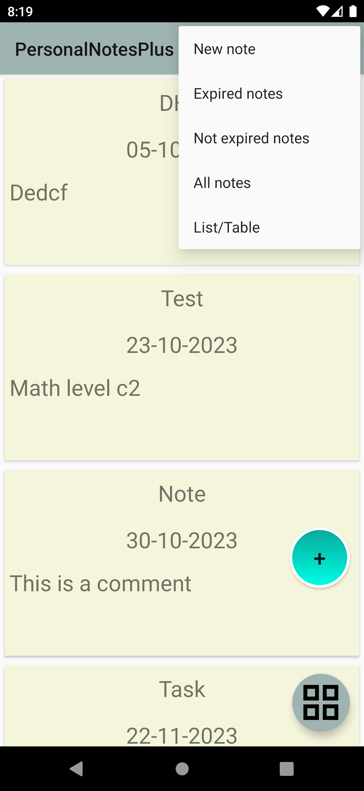
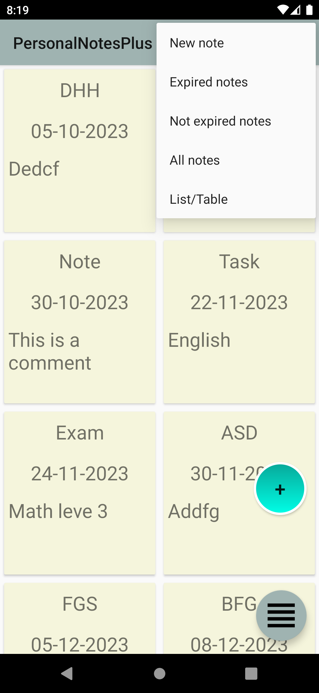
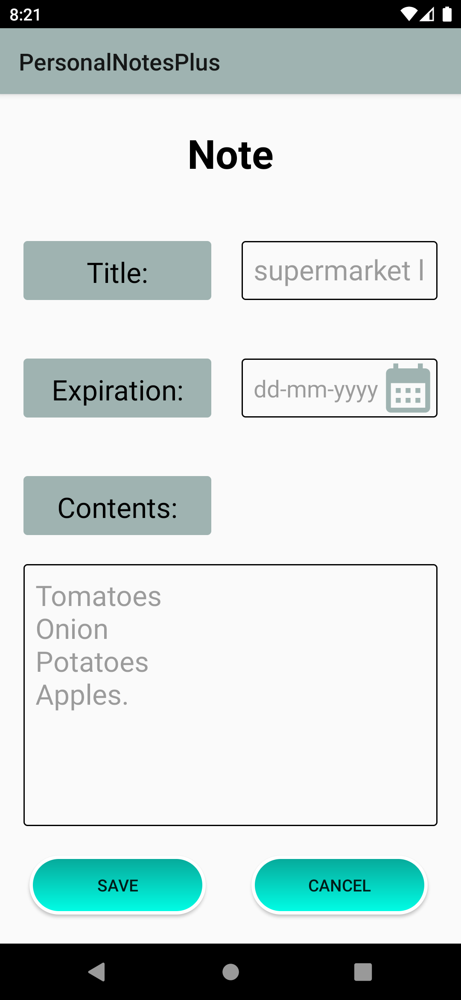
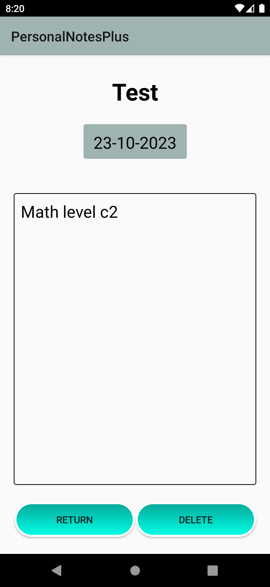

# Notes_App - Gestión de Notas en Android

Notes App es una aplicación de gestión de notas para Android desarrollada en Android Studio, con un enfoque en código limpio y eficiencia. Diseñada para proporcionar una experiencia de usuario intuitiva y eficiente en la gestión de información, esta aplicación ofrece un conjunto completo de características avanzadas para una organización efectiva de la información. Los usuarios pueden organizar y acceder fácilmente a sus notas de diversas maneras, lo que contribuye a una experiencia de usuario fluida y altamente funcional.

## Capturas de Pantalla

&nbsp;&nbsp;
&nbsp;&nbsp;
&nbsp;&nbsp;


## Características Principales

1. **Creación Rápida de Notas:**
   - Implementa formularios de entrada para registrar ideas de manera eficiente.

2. **Gestión de Fechas:**
   - Clasifica y muestra notas según su fecha de caducidad.
   - Enseña la manipulación de fechas y presentación contextual.

3. **Visión Global de Notas:**
   - Ofrece una visión completa de todas las notas.
   - Gestiona y muestra datos eficientemente para una experiencia de usuario fluida.

4. **Vistas Personalizadas:**
   - Permite cambiar entre una vista de lista y una vista de tabla para adaptarse a las preferencias del usuario.

5. **Eliminación de Notas:**
   - Funcionalidades que proporcionan control total sobre el contenido de las notas.

## Código Limpio y Eficiencia
Notas_App se destaca por su compromiso con el código limpio, facilitando el mantenimiento y escalabilidad del proyecto. La estructura lógica y la claridad del código garantizan una base sólida para el desarrollo futuro.

## Dependencia Room
Hemos integrado la dependencia Room en el proyecto para una gestión eficiente de la base de datos. Room simplifica la persistencia de datos en aplicaciones Android. Con la versión `2.2.5`, esta dependencia facilita la interacción con la base de datos para un almacenamiento y recuperación eficientes de notas.

### Configuración en `build.gradle`
```gradle
// Room dependencies
def room_version = "2.2.5"
implementation "androidx.room:room-runtime:$room_version"
annotationProcessor "androidx.room:room-compiler:$room_version"
````
La integración de Room mejora la eficiencia en la gestión de datos, reflejando nuestro compromiso con las mejores prácticas de desarrollo en el ecosistema Android.

## Instrucciones para Configurar
1. **Descarga del Proyecto:**
   - Clona o descarga el proyecto desde el repositorio de GitHub.

2. **Configuración del Entorno de Desarrollo:**
   - Asegúrate de tener Android Studio configurado y actualizado en tu sistema.

3. **Explora el Código:**
   - Estudia el código fuente para comprender la implementación de las diferentes características del menú.

4. **Haz Cambios y Experimenta:**
   - Experimenta con el código para comprender cómo se gestionan los datos y se actualiza la interfaz de usuario.
     
<br>
Notes_App es un proyecto de aprendizaje explora las características y desarrolla con Notes_App.